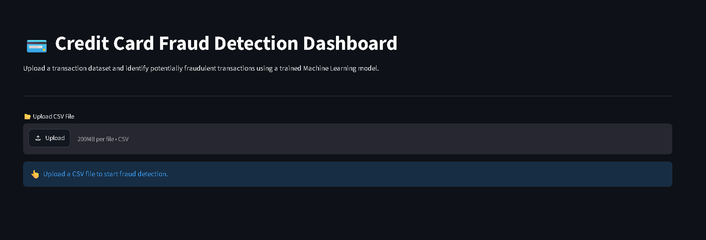
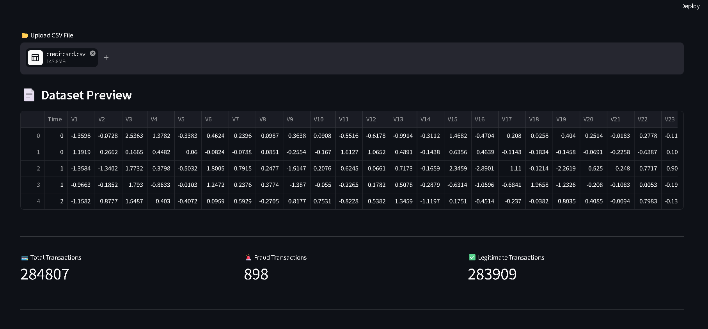
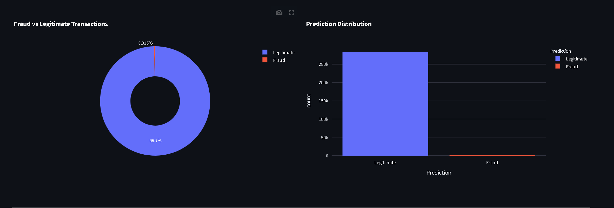
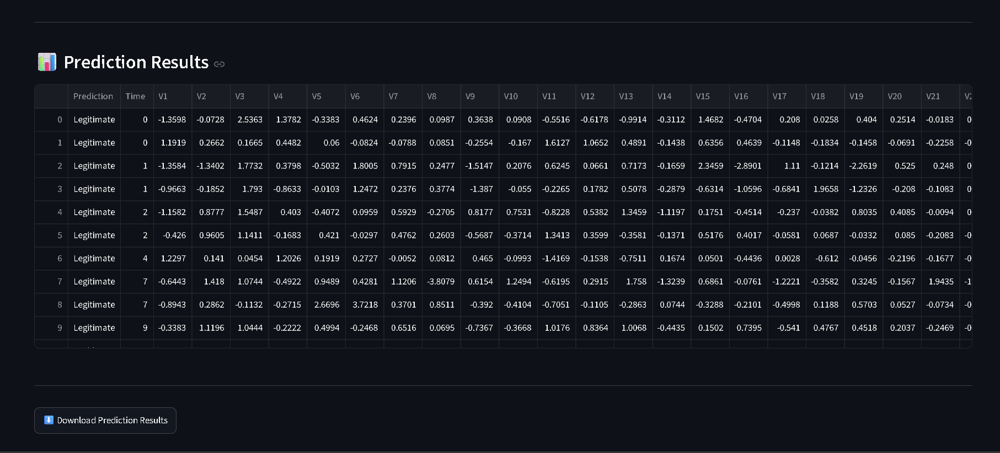

# 💳 Credit Card Fraud Detection Dashboard

An end-to-end Machine Learning application that detects fraudulent credit card transactions using classification algorithms and provides predictions through an interactive Streamlit dashboard.

---

## 🚀 Features

- Upload transaction CSV files
- Detect fraudulent transactions instantly
- Interactive dashboard with analytics
- Fraud vs Legitimate visualization
- Download prediction results
- Professional Streamlit interface

---

## 🛠️ Tech Stack

- Python
- Pandas
- NumPy
- Scikit-learn
- XGBoost
- SMOTE
- Plotly
- Streamlit
- Joblib

---

## 📂 Project Structure

```
Credit-Card-Fraud-Detection/
│
├── app.py
├── src/
├── data/
├── models/
├── notebooks/
├── reports/
├── screenshots/
├── assets/
├── README.md
├── requirements.txt
└── LICENSE
```

---

## ⚙️ Machine Learning Workflow

1. Load Dataset
2. Data Preprocessing
3. Feature Scaling
4. Handle Class Imbalance using SMOTE
5. Train Models
   - Logistic Regression
   - Random Forest
   - XGBoost
6. Compare Performance
7. Save Best Model
8. Deploy with Streamlit

---

## 📊 Evaluation Metrics

- Accuracy
- Precision
- Recall
- F1 Score
- ROC-AUC

---

## ▶️ Run Locally

Clone the repository

```bash
git clone <your-github-url>
```

Install dependencies

```bash
pip install -r requirements.txt
```

Run the application

```bash
streamlit run app.py
```

---

## 📸 Dashboard

Add screenshots inside the `screenshots` folder and update this section.
## 📸 Application Preview

### Home Page



### Preview results



### Dashboard



### Prediction Results



---

## 👩‍💻 Author

**Pushpala Deepika**

B.Tech CSE (AI & ML)

Dayananda Sagar University
